Title: Team

  <h3>
    Professor
    Andy Purvis
    - Principal investigator
  </h3>
  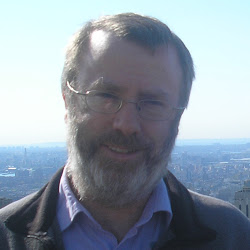
  

    Andy has been at the
    
    <a href="http://www.nhm.ac.uk/" itemscope
         itemtype="http://schema.org/Organisation">
        Natural History Museum
      </a>
     since 2013 and before then was at
    <a href="http://www.imperial.ac.uk/">Imperial College</a>'s
    Silwood Park campus from 1995. His
    <a href="http://www.bio.ic.ac.uk/research/apurvis/ajpurvis.htm">
      research interests
    </a> include conservation biology,
    biogeography and macroevolution. He first became interested in
    modelling species' responses to human impacts when the 1996 IUCN
    Red List presented the first comprehensive assessment of mammalian
    conservation status. Together with many others (including
    <a href="https://iris.ucl.ac.uk/research/personal/index?upi=GMACE69" itemprop="colleague">Georgina Mace</a>,
    <a href="http://www.ecology.uga.edu/facultyMember.php?Gittleman-25/" itemprop="colleague">John Gittleman</a>,
    <a href="https://iris.ucl.ac.uk/research/personal/index?upi=KEJON62" itemprop="colleague">Kate Jones</a>,
    <a href="http://biology.anu.edu.au/Marcel_Cardillo/" itemprop="colleague">Marcel Cardillo</a>,
    <a href="http://www.geog.ox.ac.uk/staff/rgrenyer.html" itemprop="colleague">Rich Grenyer</a>,
    <a href="http://www.zsl.org/science/ioz-staff-students/dr-jon-bielby/" itemprop="colleague">Jon Bielby</a>,
    <a href="http://www.tcd.ie/Zoology/research/research/theoretical/nataliecooper.php" itemprop="colleague">Natalie Cooper</a> and
    <a href="http://www.bik-f.de/root/index.php?page_id=772" itemprop="colleague">Susanne Fritz</a>),
    he modelled Red List status
    empirically to understand how the changes brought about by
    people interacted with species' biology to determine which species
    could persist and which would decline globally. With the PREDICTS
    project, the focus is on how species respond locally – rather than
    globally – to the changes they face; at the same time, the
    taxonomic focus is broader, covering all groups for which we are
    able to collate useful data.
  

  <h3>
    Dr
    J&ouml;rn W P Scharlemann
    - Co-investigator
  </h3>
  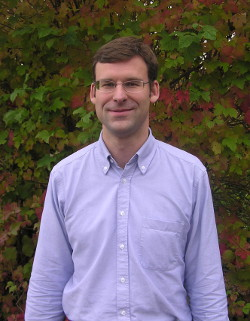
  

    J&ouml;rn is interested in quantitatively assessing the impacts of
    environmental changes on biodiversity and identifying policy-relevant
    strategies to reduce the effects of human impacts. He has recently
    moved to the
    
      <a href="http://www.sussex.ac.uk/" itemscope
         itemtype="http://schema.org/Organisation">
        University of Sussex
      </a>
    
    in Brighton to take up a readership in ecology and conservation.
    Before joining the University of Sussex in November 2012, he was the
    Senior Scientist at
    <a href="http://www.unep-wcmc.org/">UNEP World Conservation MonitoringCentre</a>
    (UNEP-WCMC) providing scientific expertise and advice to projects,
    developing a science strategy, and managing a team of scientists
    involved in biodiversity modelling (in collaboration with Drew
    Purves, Microsoft Research Cambridge) and spatial analyses. After
    receiving a BA and MSc from the
    <a href="http://www.ox.ac.uk/">University of Oxford</a>, a PhD in
    Zoology from the
    <a href="http://www.cam.ac.uk/">University of Cambridge</a>,
    J&ouml;rn worked for the
    <a href="http://www.rspb.org.uk/">RSPB</a>
    as a research biologist, and held post-doctoral
    positions at the University of Oxford and the
    <a href="http://www.stri.si.edu">Smithsonian Tropical Research Institute</a>.
    He regularly uses GIS, remote sensing, statistics and spatial
    analysis in his research.
  

  <h3>
    Dr
    Rob Ewers
    - Co-investigator
  </h3>
  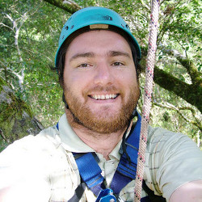
  

     Rob works on spatial patterns of forest and the biodiversity contained
     within those forests. Hi work involves investigating and trying to
     predict patterns of forest cover from local through to global
     scales, sampling of taxa within selected landscapes located in both
     temperate and tropical parts of the world, and manipulative
     experiments in both the field and lab. Most of the work
     uses invertebrates as a model system, with a focus on beetles.
  

  

    A large recent initiative is the
    <a href="http://safeproject.net/" itemprop="affiliation">
      Stability of Altered Forest Ecosystems
    </a> (SAFE) Project. This is one of the world's largest ecological
    experiments, taking advantage of a planned conversion of forest to
    oil palm in Borneo to experimentally design a landscape.  
  

  

    Also, see more details about the activities of Rob's research group on
    the
    <a href="http://forestecology.net/" itemprop="affiliation">
      Forest Ecology and Conservation Group
    </a>
    website.
  

  <h3>
    Professor
    Georgina Mace
    CBE, FRS
    - Co-investigator
  </h3>
  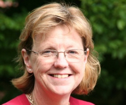
  

    Georgina Mace was previously Director of the
    <a href="http://www.nerc.ac.uk/">NERC</a> Centre for Population Biology at
    <a href="http://www.imperial.ac.uk/">Imperial College</a> and joined
    
      <a href="http://www.ucl.ac.uk/" itemscope
         itemtype="http://schema.org/Organisation">
        UCL
      </a>
    
    on 1st August 2012.
    Her research interests are in measuring the trends and
    consequences of biodiversity loss and ecosystem change. She led the
    development of criteria for listing species on
    <a href="http://www.iucn.org/">IUCN</a>'s Red List of threatened
    species, and was a coordinating lead author for biodiversity in the
    <a href="http://www.maweb.org/">Millennium Ecosystem Assessment</a>.
    Recently she has worked on the
    <a href="http://uknea.unep-wcmc.org/">UK National Ecosystem Assessment</a>,
    is a co-investigator on the NERC
    <a href="http://www.valuing-nature.net/">Valuing Nature Network</a>,
    and is an Associate Director of the
    <a href="http://www.espa.ac.uk/">Ecosystem Services for Poverty Alleviation Programme</a>,
    funded by DfID, NERC and ESRC. She was elected FRS in 2002, and was
    the 2007 winner of the International Cosmos Prize.
    She is currently a member of NERC Council, President of the
    <a href="http://www.britishecologicalsociety.org/">British Ecological Society</a>
    and Chair of the science committee for the
    <a href="http://www.diversitas-international.org/">DIVERSITAS</a>
    global change research programme.
  

  <h3>
    Dr
    Drew Purves
    - Co-investigator
  </h3>
  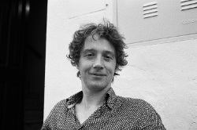
  

    Drew Purves is head of the
    <a href="http://research.microsoft.com/en-us/groups/ecology/">Computational Ecology and Environmental Science</a> group (CEES) at
    
      <a href="http://research.microsoft.com/en-us/labs/cambridge/" itemscope
         itemtype="http://schema.org/Organisation">
        Microsoft Research Cambridge
      </a>
    .
    Before joining Microsoft, Drew studied ecology at
    <a href="http://www.cam.ac.uk/">Cambridge University</a>, did a PhD
    in ecological modelling at the
    <a href="http://www.york.ac.uk/">University of York</a> (UK), and a
    5 year postdoc at
    <a href="http://www.princeton.edu/">Princeton</a>. Drew's overarching
    research interest is in combining ecological theory with large and
    varied data sets, via computational statistics, in order to produce
    quantitative, predictive models of ecological phenomena. Following
    Drew's lead, the CEES group is using this approach to build new
    models to address global environmental challenges – e.g.
    carbon-climate, food security, wood production, biodiversity and
    ecosystem function, pandemics – whilst developing new software tools
    to enable others to carry out this kind of ecological modelling.
  

  

    Drew has published over 30 research papers in top peer-reviewed
    journals, including <a href="http://www.sciencemag.org/">Science</a>,
    <a href="http://www.pnas.org/">PNAS</a>,
    <a href="http://rspb.royalsocietypublishing.org/">Proc Roy Soc B</a>,
    and most of the top ecology-specific journals.
    In 2012, he was one of 40 'young scientists' worldwide invited to
    attend the
    <a href="http://www.weforum.org/">World Economic Forum</a>
    'Summer Davos' meeting in Tianjin, China.
    He lectures at Cambridge University, and is the treasurer of
    the
    <a href="http://www.britishecologicalsociety.org/">British Ecological Society</a>,
    the world's oldest ecological society.
  

  <h3>
    Dr
    Luca Borger
    - Project partner
  </h3>
  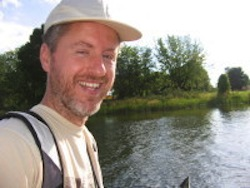
   

    Luca is interested in understanding and predicting how environmental
    change leads to changes in biodiversity dynamics. His work is not
    system specific but question-driven, thus he works on contrasting
    study systems (invertebrates, vertebrates, plants), using
    experimental, statistical, and simulation modelling approaches. His
    questions span different levels of ecological organisation, from the
    behaviour and traits of individuals to the structure and function of
    landscapes and ecosystems, and Luca is equally excited about basic
    and applied research, with a keen interest in testing and developing
    new methods. For more details, see Luca's research group on the
    <a href="http://www.movecol.org/">Movement Ecology and Biodiversity
      Dynamics Lab</a> website.  Luca has recently moved to
    <a href="http://www.swansea.ac.uk">Swansea University</a> in Wales
    to take up a readership/associate professor in ecological biosciences.
    Before joining Swansea, Luca studied Biology at the
    <a href="http://www.unipi.it/">University of Pisa</a> (Italy), did a
    PhD in Zoology at <a href="http://www.cam.ac.uk/">Cambridge</a>,
    whilst being also visiting PhD student at
    <a href="http://www.imperial.ac.uk">Imperial College</a>'s Silwood Park
    campus, followed by four years of postdocs in Canada, working on
    Movement Ecology and species distribution modelling and forest
    management, and three years of postdoc in France
    (<a href="http://www.cnrs.fr/">CNRS</a> &amp;
     <a href="http://www.inra.fr/">INRA</a>),
    working on Agroecology. He is Associate Editor for the journals
    <a href="http://www.methodsinecologyandevolution.org/">Methods in Ecology and Evolution</a> and
    <a href="http://www.journalofanimalecology.org/">Journal of Animal Ecology</a> and Review Editor for
    <a href="http://www.int-res.com/journals/esr/esr-home/">Endangered Species Research</a>.
  

  <h3>
    Dr
    Ben Collen
    - Project partner
  </h3>
  
  

    Ben Collen leads a research group focussed on developing integrated
    measures of the status and trends of biodiversity. He was previously
    Head of the
    <a href="http://www.zsl.org/science/research-projects/indicators-assessments/">
      Indicators and Assessments Unit
    </a> at the
    <a href="http://www.zsl.org/">Zoological Society of London</a>, and
    joined UCL's
    <a href="http://www.ucl.ac.uk/cber">Centre for Biodiversity &amp;
      Environment Research</a> on the 1st April 2013.
    His research is directed at using ecological and evolutionary
    principles to identify the processes underpinning heterogeneity in
    response (e.g. extinction risk, abundance change, range change,
    extinction) to a range of drivers of biodiversity loss (e.g. climate
    change, habitat degradation and exploitation). He has carried out
    field projects in Kenya, Equatorial Guinea, Mongolia, Australia,
    Tanzania, Liberia and most recently the Antarctic.
  

  <h3>
    Dr
    Lawrence Hudson
    - Post-doctoral research associate
  </h3>
  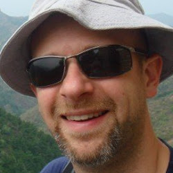
  

    <a href="http://www.nhm.ac.uk/research-curation/about-science/staff-directory/life-sciences/l-hudson/"
       itemprop="URL">
       Lawrence
    </a>
    is a post-doc in Andy Purvis' lab at the
    
      <a href="http://www.nhm.ac.uk/" itemscope
         itemtype="http://schema.org/Organisation">
        Natural History Museum</a>
    , working on PREDICTS.
    Before starting on the project, he completed
    a PhD on the structure and dynamics of food webs with
    <a href="https://eeb.ku.edu/dr-daniel-reuman">Dan Reuman</a>
    at <a href="http://www.Imperial.ac.uk/">Imperial College London</a>.
    He is the author and maintainer of the
    <a href="http://cran.r-project.org/web/packages/cheddar/index.html">Cheddar</a>
    <a href="http://www.r-project.org/">R</a> package.
  

  <h3>
    Dr
    Tim Newbold
    - Post-doctoral research associate
  </h3>
  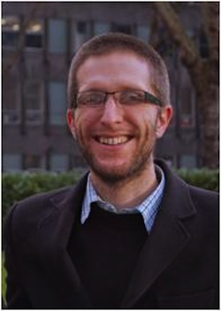
  

    <a href="http://sites.google.com/site/timnewbold31" itemprop="URL">
    Tim</a> is an ecologist, whose main interest is in understanding the
    impact of human activities on the ecological communities. As well as
    working on the PREDICTS project, he also part of a team building a
    global mechanistic model of ecosystem structure and function,
    <a href="http://madingleymodel.org/">The Madingley Model</a>. Tim
    studied Zoology and completed a PhD on Egyptian biodiversity at
    Nottingham University.
  

  <h3>
    Sara Contu - Technician
  </h3>
  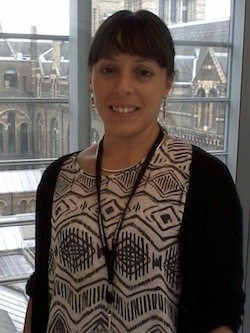
  

    Sara has a MSc in Natural Sciences with a Conservation focus and she
    is interested in how human activities influence ecological processes
    and how this is changing species' distribution ranges and
    conservation status. She has worked as IUCN Conservation Assessor for
    several Institutions, including the
    <a href="http://www.kew.org">Royal Botanic Gardens, Kew</a> and the
    <a href="http://www.nhm.ac.uk/">Natural History Museum</a>,
    assessing plant species' risk of extinction.
  

  <h3>
    Dr
    Sam Hill
    - Technician
  </h3>
  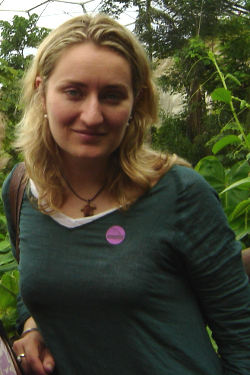
  

    Sam's past research focussed on the conservation of aquatic
    invertebrates with a particular interest in the role of host-parasite
    interactions in limiting population sizes and changing population
    dynamics. Since completing her PhD at the
    <a href="http://www.reading.ac.uk/">University of Reading</a>, Sam
    has undertaken post-doctoral research at
    <a href="http://www.bris.ac.uk/">Bristol University</a> and has
    worked within private industry.
  

  <h3>
    Dr
    Adriana De Palma
    - Post-doctoral Research Associate on PREDICTSv2
  </h3>
  
  

    Adriana is particularly interested in using extensive ecological
    datasets to understand how biodiversity is impacted by human activities.
    Adriana completed her PhD at <a href= "http://www3.imperial.ac.uk/">
    Imperial College London</a> and the
    <a href="http://www.nhm.ac.uk/">Natural History Museum</a>,
    which explored land-use impacts on bee
    diversity in collaboration with the PREDICTS project.
    She is now the post-doctoral research associate on the new stage of the
    PREDICTS project, which explores how biodiversity responds over time to
    land-use impacts.
  

  

    Have a look at Adriana's blog,
    <a href="http://therostrumblog.wordpress.com/">The Rostrum</a>, for
    more information.
  

  <h3>
    Dr
    Igor Lysenko
    - Biodiversity GIS analyst
  </h3>
  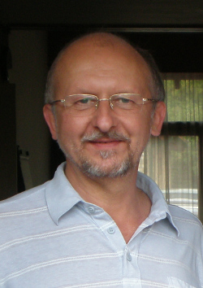

  <h3>
    Victoria Burton - PhD student
  </h3>
  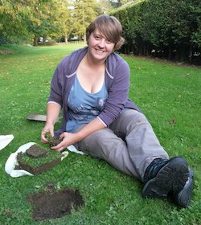
  

    Victoria completed a BSc in Natural Sciences with the
    <a href="http://www.open.ac.uk/">Open University</a>
    in 2011 followed by an
    <a href="http://www.nhm.ac.uk/research-curation/training/msc-taxonomy/index.html">
      MSc in Taxonomy and Biodiversity
    </a> at Imperial College London.
    Her PhD at Imperial focuses on
    soil and litter biodiversity, investigating how the
    composition of these communities will respond to
    predicted land use change in the UK.
    This combines new and existing data, including extensive
    datasets from the Natural History Museum Soil
    Biodiversity Group, where her MSc project was based.
  

  

    Victoria's PhD is funded by
    <a href="http://www.nerc.ac.uk/">NERC</a> through
    Imperial's
    <a href="http://www3.imperial.ac.uk/changingplanet">
      Science and Solutions for a Changing Planet
    </a> Doctoral Training Programme.
  

<h3>
  Katia Sanchez Ortiz - PhD student
</h3>
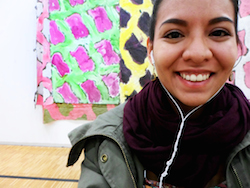

  Katia graduated from the
  <a href="http://www.uaem.mx/">Universidad Autónoma del Estado de Morelos</a>
  (Mexico) in 2012 with an honours degree in Biology and she completed a
  MRes in Biodiversity, Evolution &amp; Conservation at University College London.
  Her PhD at Imperial College London focuses on human impact on islands
  biodiversity, comparing patterns of biodiversity response to land-use change
  on islands and mainlands. Her project also investigates whether native and
  alien species on islands respond differently to land-use change.
  Katia is currently funded by <a href="http://www.conacyt.mx/">CONACyT</a> -
  the National Council of Science and Technology of Mexico.

  <h3>
    Helen Phillips - PhD student
  </h3>
  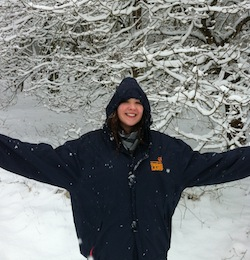
  

    Helen started her PhD with the PREDICTS project in 2012, following on
    from an
    <a href="http://www3.imperial.ac.uk/lifesciences/postgraduate/courselist/ecology">
    Ecology, Evolution and Conservation Master's
    </a>
    at Imperial. Helen's MSc project was also based with the PREDICTS
    team; investigating the effect on biodiversity of land-use change at
    a continent level – with particular focus on the transition of
    primary forest and secondary forest to plantation forests. For her
    PhD, Helen continued to expand upon her Master's project, as
    well as investigate the effect of habitat fragmentation on
    biodiversity. Helen is now a postdoctoral researcher at the Idiv in Leipzig, Germany.
  

  
Helen's PhD has been funded by a Hans Rausing Scholarship.

<h3>
  Terence Chung - MRes student
</h3>
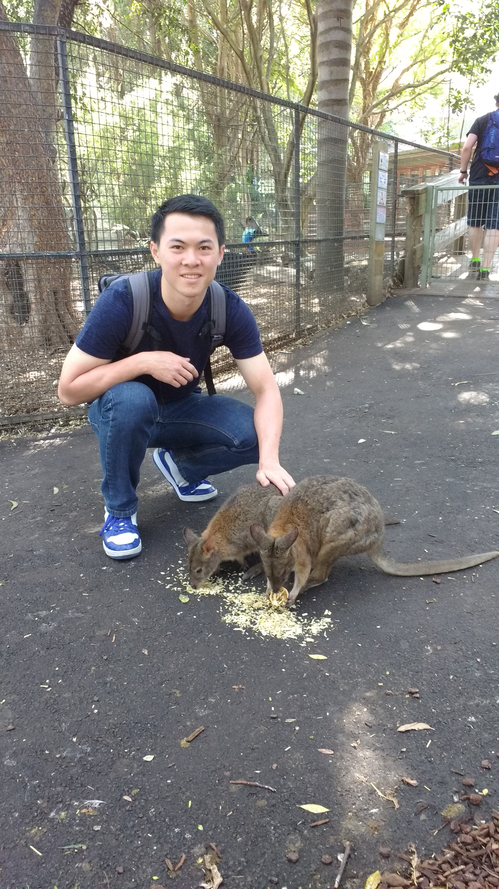

  Terence graduated from Imperial College London in 2016 with an honours degree in Biology. He continued his studies at Imperial College London, studying for his MRes degree in Ecology, Evolution and Conservation. Terence’s thesis project with PREDICTSv2 focuses on the effects of establishment, expansion and intensification of biofuel crops on biodiversity.

<h3>
  Tom Brewer - MRes student
</h3>
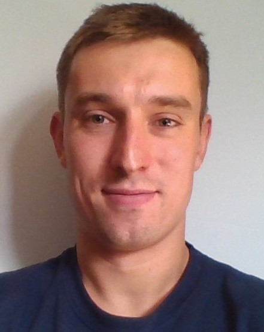

  Tom graduated in 2015 from the University of Leeds with a BSc (Hons) in Zoology, which included a 12-month research placement at the Defence Science and Technology Laboratory. He is currently enrolled on the MRes in Ecology, Evolution and Conservation at Imperial College London, where he is conducting his winter research project within the PREDICTS team. His project aims to investigate the responses of biodiversity to agricultural expansion and intensification.

<h3>
  Emily Warner - MRes student
</h3>
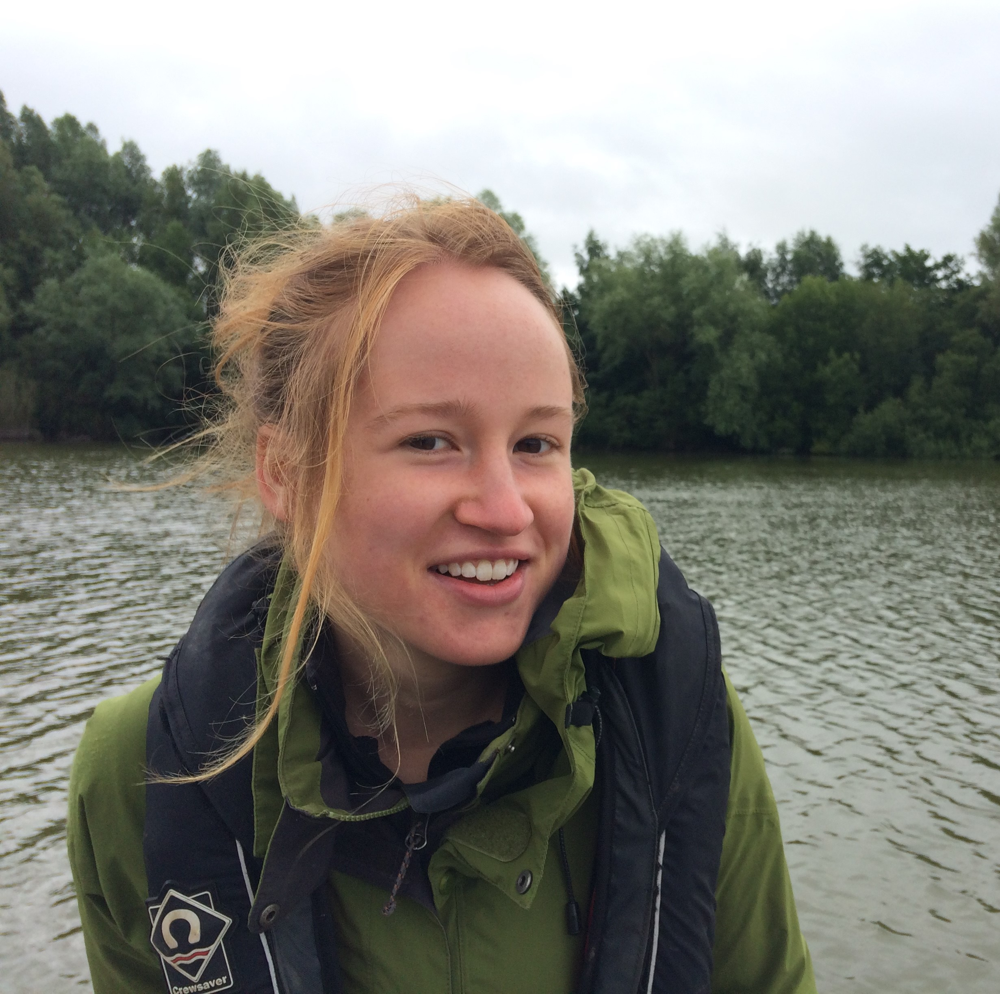

  Emily is currently studying for an MRes in Ecology, Evolution and Conservation at Imperial College London. Having graduated from a degree in Biological Sciences from the University of Oxford in 2015, Emily spent a year volunteering and working for a number of conservation NGOs, including Trees for Life and Herefordshire Wildlife Trust. Her PREDICTS project will build on her interest in restoration ecology, looking at the terrestrial biodiversity response following habitat restoration.  

<h3>
  Jack Bonnick - MRes student
</h3>
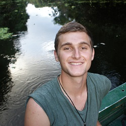

  I graduated in 2016 from Oxford Brookes University with a BSc (Hons) in Animal Biology and Conservation. I am currently studying an MRes in Biodiversity, Evolution and Conservation at University College London, in collaboration with ZSL and the Natural History Museum. My research project with the PREDICTS team will focus on the effects of land use change on island biodiversity.

<h3>
  Mark Titley - MRes student
</h3>
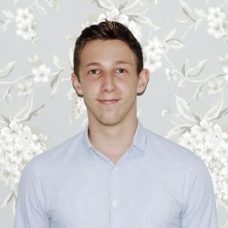

  Following his degree in Natural Sciences (Zoology) at the University of Cambridge, Mark worked for two months at UNEP-WCMC, where he first became involved with PREDICTS. Mark’s current research, for his MRes in Ecosystem and Environmental Change at Imperial College London, will investigate how biodiversity responds over time after small-scale deforestation.

<h3>
  Oliver Scott - MRes student
</h3>
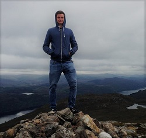

  Oliver is currently studying an MRes in Ecosystem and Environmental Change at Imperial College London. Having graduated with a degree in Biological Sciences from the University of Warwick in 2015, he spent a year working in a number of different industries before deciding to continue higher education. His project will focus on the functional traits responsible for resilience in ecosystems undergoing restoration.

<!-- PAST PROJECT MEMBERS HERE -->

  
Past project members

  <h3>
    Dr
    Claudia Gray
    - Post-doctoral research associate
  </h3>
  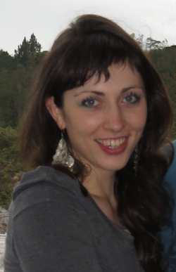
  

    Claudia was a post-doc in
    <a href="http://www.sussex.ac.uk/lifesci/scharlemannlab/">
      J&ouml;rn Scharlemann's
    </a> lab at the University of Sussex and is now an EDGE Fellow at the <a href = "http://www.edgeofexistence.org/community/member_info.php?id=245"> Zoological Society of London </a>. She is interested in human
    impacts on biodiversity and how scientific evidence can inform
    environmental policy and natural resource management. Claudia did her
    PhD at <a href="http://www.zoo.ox.ac.uk/">Oxford University</a>,
    quantifying the impact of riparian zone management on biodiversity
    and ecosystem services in oil palm plantations (within and around
    the <a href="http://www.safeproject.net/">S.A.F.E. project</a>). She
    also has an MSc in Biodiversity, Conservation and Management from
    Oxford University, and did her undergraduate degree in Zoology at
    Cambridge University.
  

<h3>
  Emma Caton - Master's Student
</h3>
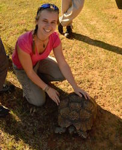

  After completing her BSc (Hons) Zoology degree at the
  <a href="http://www.leeds.ac.uk/">University of Leeds</a>,
  Emma enrolled straight onto a Masters degree in
  <a href="http://www3.imperial.ac.uk/lifesciences/postgraduate/courselist/ecology">
    Ecology, Evolution and Conservation</a> at
  Imperial College London.
  Her Masters project involves linking PREDICTS
  to the next generation of land-use scenarios.

<h3>
  Greg Counsell - Master's Student
</h3>
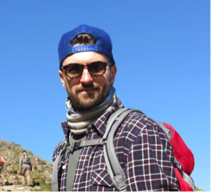

  Greg is currently studying for his MSc in
  <a href="http://www3.imperial.ac.uk/lifesciences/postgraduate/courselist/ecology">
  Ecology, Evolution and Conservation</a> at Imperial College London.
  His PREDICTS project is looking at how land-use change
  impacts biodiversity, with a focus on agricultural abandonment.
  Since receiving his undergraduate degree in Zoology from the
  <a href="http://www.manchester.ac.uk/">University of Manchester</a>
  in 2013 he has worked in both science policy
  with the
  <a href="http://www.britishecologicalsociety.org/">British Ecological Society</a>,
   and in science communication at the University of Manchester.

<h3>
  Felipe Espinoza De Janon - Master's Student
</h3>
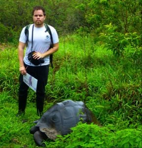

  Felipe obtained his undergraduate degree in
  Environmental Engineering (Hons) from
  <a href="http://uees.me/">Universidad de Especialidades Espiritu Santo</a> (Ecuador) in 2013.
  He is currently studying for his Masters degree
  in <a href="http://www.imperial.ac.uk/life-sciences/postgraduate/masters-courses/msc-in-taxonomy--biodiversity/">
  Taxonomy and Biodiversity</a>, run jointly by
  Imperial College London and the Natural History Museum,
  funded by a scholarship from the Ecuadorian government (SENESCYT).
  His PREDICTS project is investigating how biodiversity is
  impacted using the next generation land-use scenarios, with specific focus on  
  managed pastures and rangelands.

<h3>
  Harriet Lambert - Master's Student
</h3>
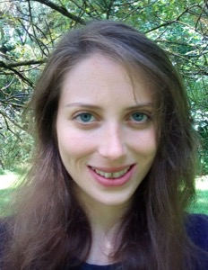

  Harriet is currently undertaking an MSc in
  <a href="http://www3.imperial.ac.uk/lifesciences/postgraduate/courselist/ecology">
  Ecology, Evolution and Conservation</a>
  at Imperial College London. Her project at PREDICTS is focussing on land use
  impacts on bee diversity, extending an ongoing analysis of bees in Europe
  in order to assess how different assemblages respond to human pressures.
  Since completing her undergraduate degree in Biology at the
  <a href="http://www.ox.ac.uk/">University of Oxford</a>,
  Harriet has been able to expand her interest in
  pollinator ecology and biocommunication.

<h3>
  Alex Raposo - Master's Student
</h3>

  Alex is currently studying for her MRes in
  <a href="http://www3.imperial.ac.uk/lifesciences/postgraduate/courselist/ecology">
  Ecology, Evolution and Conservation</a>
  at Imperial College London.
  Her PREDICTS project aims to understand the effects of logging on biodiversity
  through time, with a focus on selective logging practices.
  Since completing her undergraduate degree in Biodiversity and Conservation
  from the
  <a href="https://www.utoronto.ca/">
  University of Toronto</a> in 2015, she has collaborated with Dr. Isabel
  Rosa and Dr. Andrew Bradley on improving
  <a href="http://stocmodlcc.net/">StocModLCC</a>,
  a spatially-explicit model of land-use and land change used
  to understand patterns of deforestation in the Brazilian Amazon.

<h3>
  Sasha Suryometaram - Master's Student
</h3>
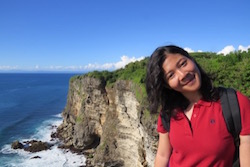

  Following a B.Sc. in Biology from the
  <a href="http://www.ui.ac.id/en/">University of Indonesia</a> in 2009,
  Sasha is currently pursuing an
  <a href="http://www3.imperial.ac.uk/lifesciences/postgraduate/courselist/ecology">M.Sc. in Ecology, Evolution and Conservation</a>
   at Imperial College London.  
  Her thesis project with the PREDICTS team focuses on the land-use
  impacts on soil macro-invertebrate biodiversity.

<h3>
  Gemma Annetts - Intern
</h3>
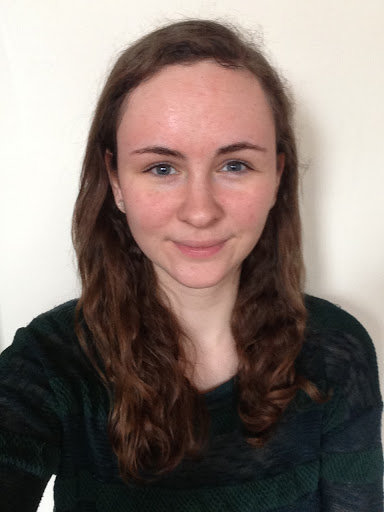

  Gemma has just completed her second year of studying Natural Sciences
  at <a href="http://www.pet.cam.ac.uk/">Peterhouse, University of Cambridge</a>.
  Next year she will be
  specializing in Zoology, with a view to undertaking a Master’s degree
  the following year. Gemma is working as an intern on PREDICTS in the
  Science programme of <a href="http://www.unep-wcmc.org/">UNEP-WCMC</a>.
  She is currently investigating how the responses of biodiversity to
  different land use changes are affected by both current climate and
  climate change.

<h3>
  Dom Bennett - Master's student
</h3>
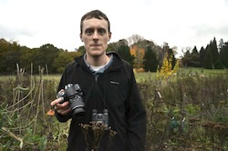

  Dom undertook an
  <a href="http://www3.imperial.ac.uk/pgprospectus/facultiesanddepartments/lifesciences/postgraduatecourses/biodiversityinformaticsgenomics">
    MRes in Biodiversity Informatics and Genomics
  </a>
  at Imperial College London. In Andy's lab, he used the
  <a href="http://willpearse.github.com/phyloGenerator/index.html">Phylogenerator</a>
  software to focus on how phylogenetic diversity responds to human
  impacts, with a particular emphasis on urban ecosystems.
  Currently, Dom is a PhD student in Earth Sciences at Imperial College London
  and the Institute of Zoology

<h3>
  Charlotte Chng - MRes student
</h3>
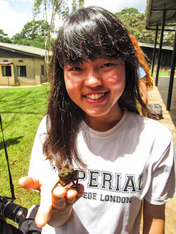

  Charlotte completed her
  <a href="http://www3.imperial.ac.uk/lifesciences/postgraduate/courselist/ecologyresearch">
    MRes in Ecology, Evolution and Conservation
  </a>
  at Imperial College London. Her project involved the modelling of
  land-use effects on biodiversity in New Zealand. Charlotte previously
  studied Biology at Imperial College London, where she graduated in 2014.

  After completing her research project with the PREDICTS team, Charlotte
  researched the relationship between age and reproductive fitness in
  a captive house sparrow population at the Max-Planck Institute for
  Ornithology in Germany.

<h3>
  Argyrios (Sylvester) Choimes – Master's student
</h3>
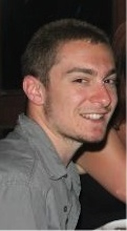

  Sylvester was studying the
  <a href="http://www.nhm.ac.uk/research-curation/training/msc-taxonomy/index.html">
    MSc in Taxonomy and Biodiversity
  </a> at Imperial College London and the Natural History Museum. His
  project focused upon human impact on biodiversity in Mediterranean
  ecosystems. Sylvester graduated from
  <a href="http://www.cardiff.ac.uk/">Cardiff University</a> with a
  degree in Biology in 2012.

<h3>
  Leejiah Dorward - Intern
</h3>
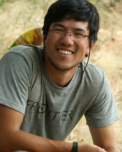

  Leejiah's research interests are the interactions between poor rural
  communities and their local environment. He was working on the
  PREDICTS project looking at human impacts on biodiversity in Central
  Asia and Sub-Saharan Africa. Leejiah has recently graduated from
  Imperial's
  <a href="http://www3.imperial.ac.uk/lifesciences/postgraduate/courselist/conservationscience">
    Conservation Science
  </a> MSc. Prior to the MSc he studied for a PGCert with
  <a href="http://www.soas.ac.uk/">SOAS</a> in Managing Rural
  Development and a BSc in Environmental Science at
  <a href="http://www.uea.ac.uk/">UEA</a>.

<h3>
  Susan Emerson - Master's student
</h3>
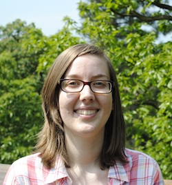

  Susan graduated from the
  <a href="http://www.reading.ac.uk/">University of Reading</a>,
  with a degree in Zoology in 2013. She completed her
  <a href="http://www.nhm.ac.uk/research-curation/training/msc-taxonomy/index.html">
    MSc in Taxonomy and Biodiversity
  </a> at Imperial College London and the
  Natural History Museum. Her project concentrated on
  biodiversity hotspots to examine whether they are particularly
  sensitive to human impacts.

<h3>
  Susy Echeverr&iacute;a-Londo&ntilde;o
  - Master's student
</h3>
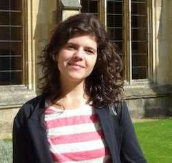

  After studying Biology at
  <a href="http://www.uis.edu.co/">Universidad Industrial de Santander</a>
  (Colombia), Susy undertook an
  <a href="http://www3.imperial.ac.uk/pgprospectus/facultiesanddepartments/lifesciences/postgraduatecourses/biodiversityinformaticsgenomics">
    MRes in Biodiversity Informatics and Genomics
  </a>
  at Imperial College London. Her research was based on the response of
  Colombian biodiversity to human impacts. Susy is now undertaking a PhD at Imperial College London and the Natural History Museum, funded by COLCIENCIAS (The Administrative
  Department of Science, Technology and Innovation of Colombia–in
  spanish: Departamento Administrativo de Ciencia, Tecnolog&iacute;a e
  Innovaci&oacute;n).

<h3>
  Melanie Jane Edgar
</h3>

  Melanie graduated from
  <a href="http://www.dur.ac.uk/‎">Durham University</a>
  with a BSc Ecology, Evolution and Behaviour and
  studied the MRes Biosystematics at Imperial College London with
  the hope of starting a PhD in 2014/2015. Her project was focused on
  determining the predictability of physical and ecological traits in
  Coleoptera, including body length, invasiveness and geographic range
  size, from phylogenetic trees, i.e. determining whether closely
  related species share traits. The resulting database is used as
  part of the PREDICTS models of biodiversity.

<h3>
  Helen Ford - Master's student
</h3>
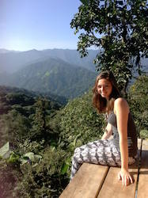

  Helen has completed a Bsc in Biology at the
  <a href="http://www.sussex.ac.uk/">University of Sussex</a>,
  which she steered towards ecology and conservation modules.
  After her undergraduate degree, she decided to take a year out to
  travel in Asia and Australia and gain experience volunteering for
  various conservation organisations. She has recently started
  her MRes in Ecology, Evolution and Conservation at
  <a href="http://www.Imperial.ac.uk/">Imperial College London</a>
  and is currently working on her first project with PREDICTS.
  Helen's project focuses on whether the biodiversity in different
  layers of strata are unevenly impacted by land-use change.

<h3>
  Di Gao - Master's student
</h3>
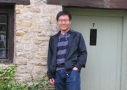

  Di undertook an
  <a href="http://www3.imperial.ac.uk/lifesciences/postgraduate/courselist/ecology">
    MSc in Ecology, Evolution and Conservation
  </a>
  at Imperial College London. He investigated the effects of
  human land-use and use intensity on biodiversity in China.
  He graduated from
  <a href="www.nju.edu.cn/">Nanjing University</a> with a bachelor
  degree in Biological Sciences in 2013.

<h3>
  Morgan Garon - Master's student
</h3>
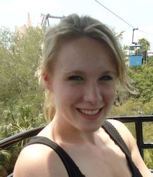

  Morgan was a student on the
  <a href="http://www3.imperial.ac.uk/lifesciences/postgraduate/courselist/ecology">
  Ecology, Evolution and Conservation MSc course
  </a>
  at Imperial College London. Her project focused on the response
  of invertebrate and plant species to human impacts in agricultural
  systems within temperate regions. Morgan graduated from the
  <a href="http://www.ed.ac.uk/">University of Edinburgh</a> in 2011
  with an honours degree in Zoology.

<h3>
  Guillermo Gilbert - Master's student
</h3>
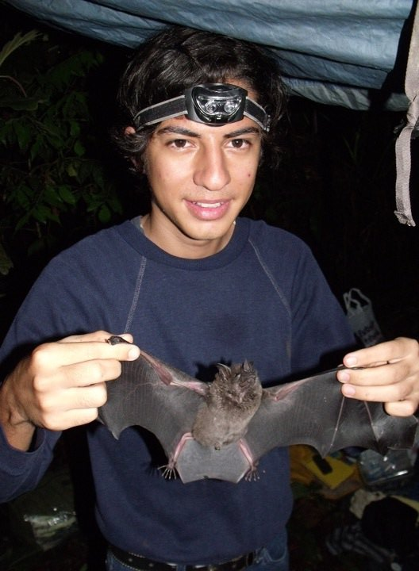

  After studying Biology at <a href="http://www.ug.edu.ec/">Universidad de Guayaquil</a> (Ecuador),
  Guillermo is undertaking an MRes in Ecology Evolution and Conservation
  at <a href="http://www.Imperial.ac.uk/">Imperial College London</a> funded by
  <a href="http://www.educacionsuperior.gob.ec/">SENESCYT</a>
  (National Secretary of Higher Education, Science and Technology–in spanish:
  Secretaria Nacional de Education Superior Ciencia y Tecnologia).
  His MRes project is based with the PREDICTS team with interest on
  the before-after control-impact studies to understand the changes
  of biodiversity caused by human impacts.

<h3>
  Lorna Harvey - Master's student
</h3>
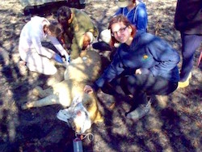

  Lorna is currently studying for her MRes in Ecology Evolution and Conservation
  at <a href="http://www.Imperial.ac.uk/">Imperial College London</a>.
  Her project is focusing on Land use impacts on
  bee biodiversity. She completed her undergraduate degree in Animal Science at
  <a href="http://www.nottingham.ac.uk/">University of Nottingham</a>
  in 2011 and has spent the last few years gaining field research experience in Africa.

<h3>
  John Hughes - Master's student
</h3>
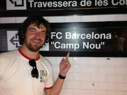

  John was undertaking an
  <a href="http://www3.imperial.ac.uk/lifesciences/postgraduate/courselist/ecologyresearch">
    MRes in Ecology, Evolution and Conservation
  </a> at Imperial College London. His project focused on the
  responses of New Zealand's biodiversity to human impacts. John
  graduated from the <a href="http://www.gla.ac.uk/">‎University of
  Glasgow</a> in 2013 with an honours degree in Zoology.

<h3>
  Daniel Ingram - Master's student
</h3>
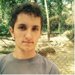

  Daniel was studying at Imperial College London undertaking an
  <a href="http://www3.imperial.ac.uk/lifesciences/postgraduate/courselist/ecology">
  MSc in Ecology, Evolution and Conservation
  </a>. His project modelled the local biodiversity responses to
  shifting agriculture in tropical ecosystems and tested whether
  agriculture's residence time is around 15 years, as is currently
  assumed from the IPCC Integrated Assessment Models. Daniel graduated
  from the
  <a href="http://www.birmingham.ac.uk/">University of Birmingham</a>
  in 2012 with an honours degree in Biological Sciences, and is now a
  PhD student at the University of Sussex, supervised by J&ouml;rn
  Scharlemann and Lauren Coad. His research focuses on quantifying the exploitation
  of terrestrial wild animals.

<h3>Stewart Jennings - Master's student</h3>

  Stewart's project modelled the relationship between biodiversity
  and remotely-sensed vegetation index data. The vegetation index data
  provides a quantitative measure of habitat disturbance, and the best
  spatial scale at which to model this disturbance will be tested.

<h3>
  Victoria Kemp - Master's student
</h3>
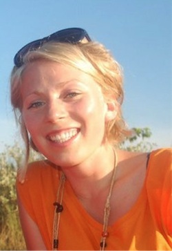

  Victoria undertook an
  <a href="http://www3.imperial.ac.uk/lifesciences/postgraduate/courselist/ecologyresearch">
    MRes in Ecology, Evolution and Conservation
  </a>
  Imperial College's Silwood Park campus. She worked with the
  PREDICTS team, focusing upon human impact on biodiversity in high
  latitude ecosystems. Before starting the masters Victoria studied
  Zoology at the
  <a href="http://www.leeds.ac.uk/">University of Leeds</a>. Victoria
  is currently studying for a PhD, investigating the effects of fragmentation
  on above-belowground linkages at the  <a href="http://safeproject.net/">S.A.F.E project</a>
  in Sabah, Borneo.

<h3>
  David Laginha Pinto Correia - Intern
</h3>
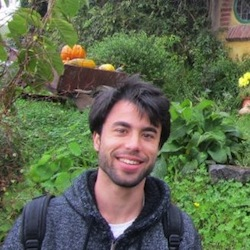

  David has just graduated from Imperial College London with an MSc in
  <a href="http://www3.imperial.ac.uk/lifesciences/postgraduate/courselist/conservationscience">
    Conservation Science
  </a>. He was working with the PREDICTS team and with the
  <a href="http://www.iucn.org">IUCN</a> Small Mammals Specialist Group.
  Before doing his MSc David completed a Post-Graduate course in
  Conservation Biology and a BSc in Environmental Biology with the
  <a href="http://www.ulisboa.pt/">University of Lisbon</a>.

<h3>Callum Martin - Master's student</h3>
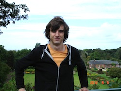

  Callum studied the
  <a href="http://www3.imperial.ac.uk/lifesciences/postgraduate/courselist/ecology">
    MSc in Ecology, Evolution and Conservation
  </a>
  at Imperial College London. His project involved quantifying how
  biodiversity of secondary habitat changes with time since recovery
  began. Callum previously studied at the
  <a href="http://www.manchester.ac.uk/">University of Manchester</a>
  where he graduated with a degree in Zoology in 2012.

  Callum is currently researching the impacts of parasitism on bumblebee
  behaviour, and whether parasites can affect the pollination services
  bumblebees provide to both crops and wildflowers at
  <a href="https://www.royalholloway.ac.uk/home.aspx">Royal Holloway University of London</a>s.

<h3>
  Joseph Middleton Welling - Master's student
</h3>
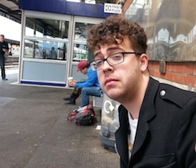

  Joseph studied the
 <a href="http://www.nhm.ac.uk/research-curation/training/msc-taxonomy/index.html">
  MSc in Taxonomy and Biodiversity
 </a> at Imperial College London
 and the Natural History Museum. He used the data in the PREDICTS database
 to establish correlates of
 extinction risk in Lepidoptera throughout the world. Joseph previously
 studied Biological Science at the
 <a href="http://www.uea.ac.uk/">University of East Anglia</a>, and
 is about to start a PhD at <a href="https://www.brookes.ac.uk/homepage/">Oxford Brookes University</a> looking into trait evolution and reponses to evironmental change in the Nymphalidae

<h3>
  Yuan Pan - Master's student
</h3>

  Yuan studied the
  <a href="http://www3.imperial.ac.uk/lifesciences/postgraduate/courselist/ecologyresearch">
    MRes in Ecology, Evolution and Conservation
  </a>
  at Imperial College London. Her project investigated
  how humans impact biodiversity, using China as a case study. Yuan
  graduated from Imperial College in 2012, with a degree in Biology.

<h3>
  Gwilym Pask-Hale - Master's student
</h3>
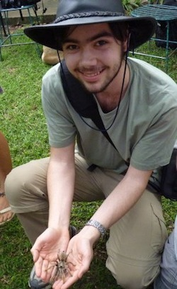

 Gwilym attended the
 <a href="http://www.hull.ac.uk/">University of Hull</a> undertaking
 a bachelor degree in Zoology, specialising in modules focused on
 Evolution and Conservation. Before and during this degree he
 volunteered with a number of conservation organisations ranging from
 South African Game and Nature reserves to zoos specialising in rare
 species. Lessons from these experiences have given him a wide
 range of knowledge on conservation efforts and furthered his desire
 to work in conservation. To improve his knowledge base and skill-set
 he undertook an
 <a href="http://www.nhm.ac.uk/research-curation/training/msc-taxonomy/index.html">
  MSc in Taxonomy and Biodiversity
 </a> at Imperial College London. His project for PREDICTS
 investigated the relationship between size and extinction risk from
 human impacts.

<h3>
  Maeve Ryan - Intern
</h3>
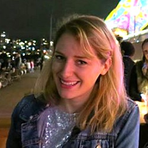

  Maeve studied the
  <a href="http://www.kcl.ac.uk/prospectus/graduate/environment-and-development">
    MSc in Environment and Development
  </a> at King's College London. Her project involved matching the major
  taxonomic groups used to classify species in PREDICTS to the functional
  groups used in the
  <a href="http://www.madingleymodel.org/">Madingley Model</a>,
  so that the two models can make predictions about the same aspects of the
  structure of ecological assemblages. Maeve previously studied at
  <a href="https://www.tcd.ie/">Trinity College Dublin</a> where she
  graduated with a degree in Environmental Science in 2013.

<h3>
  Rebecca Senior - Intern
</h3>
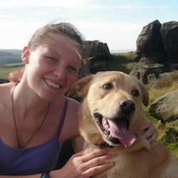

  Rebecca graduated from <a href="http://www.kings.cam.ac.uk/">
  King's College, University of Cambridge</a>, where she studied
  Natural Sciences (Zoology). Rebecca was an intern in the Science programme of
  <a href="http://www.unep-wcmc.org/">UNEP-WCMC</a> working on PREDICTS.
  She modelled how species' traits such as seed mass, plant height and vertebrate
  body mass vary with land use change.

  Rebecca is now a PhD student at the
  <a href="http://www.sheffield.ac.uk/">University of Sheffield</a>,
  researching the impacts of selective logging on tropical climate refugia and the ectotherms that utilise them.

<h3>
  Benno Simmons - MRes student
</h3>
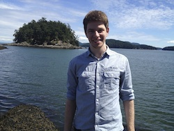

  Benno studied for an
  <a href="http://www3.imperial.ac.uk/lifesciences/postgraduate/courselist/ecologyresearch">
    MRes Ecology, Evolution and Conservation
  </a>
  at Imperial College London, where his project examined whether the biota of
  biodiversity hotspots is unusually sensitive to human impacts. Benno graduated
  from the <a href="http://www.ox.ac.uk/">University of Oxford</a> in 2014 with
  a degree in Geography, where he focused on ecology, biodiversity conservation
  and species' responses to climate change. Benno is going on to start a PhD on global plant-pollinator interactions at the <a href = "https://www.cam.ac.uk/">University of Cambridge</a>,
  supervised by Bill Sutherland.

<h3>
  Hanbin Zhang - Master's student
</h3>
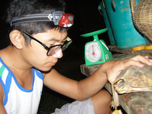

  Hanbin was a student taking an MSc in
  <a href="http://www3.imperial.ac.uk/environmentalpolicy/teaching/msc">
    Environmental Technology
  </a> at Imperial College London. He realised his passion in
  conservation from volunteer fieldwork, which involves conservation
  for a few flagship endangered species with front-line NGOs in
  Philippines islands, Tibetan plateau and Yunnan old forest, China.
  He worked with the PREDICTS team focusing on the response of
  large mammals diversity to human impacts. Hanbin graduated from
  <a href="http://www.cityu.edu.hk/">City University of Hong Kong</a>
  in 2013, with a bachelor degree in Environmental Policy Studies.

 <!-- This is for the jquery toggle -->

